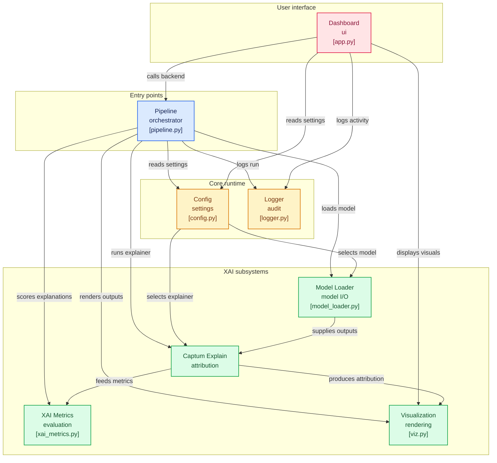

# ALETHEIA: the explainable AI engine

**see inside the black box, know why your AI thinks what it thinks**

aletheia is a **production ready XAI framework** built to make deep learning models **transparent, auditable, and badass**

perfect for **medical imaging, defense, or any mission critical ML system**   

---

## why was aletheia born?

AI is powerful, but black box models are dangerous in critical domains:

- medical imaging decisions without explanations --> lives at risk

- defense or surveillance AI without interpretability --> catastrophic errors

- business decisions from opaque ML --> unaccountable outcomes

**aletheia exists to solve this**

it answers the essentiel question:

  - "why did my AI make this decision?"

by providing **clear visualizations and metrics**, aletheia turns opaque models into explainable, auditable systems
 
---

## what is aletheia?

aletheia is:

- a framework for explainable AI (XAI)

- a toolkit for visualizating why models make predictions

- a dashboard for interactively exploring predictions and explanations

- a production ready library, modular, extensible, and auditable 

it is designed for real world usage, not just academic demos; drop in your model, run your explainer and see exactly why the AI made its choice 

---

## who is it for? 

- data scientists needing **trust worthy model explanations**

- healthcare professionals auditing AI based diagnostics

- AI engineers building **transparent, auditable ML systems**

- students or researchers exploring **interpretable ML**

if you ever asked:

  - "how do i know my model is not hallucinating?"

  - "which pixels influenced this decision?"

aletheia IS the answer

---

## how does it work?

1. **user input:** 

upload an image or select a sample --> the system knows what you want explained

2. **model inference:**

your PyTorch model predicts labels and outputs raw logits

3. **explanation generation:**

Captum explainers generate attribution maps highlighting why the model predicted what it did

4. **visulizations & metrics:**

overlay heatmaps, compute faithfulness or sensitivity, audit your AI's decisions

5. **dashboard & reporting:**

streamlit dashboard renders predictions + explanations in real time 

optionally, export results to outputs/ for auditing

**[user_upload]-->[model_prediction]-->[explainer]-->[metrics_&_visualization]-->[dashboard]

---

## why should you care?

- **transparency:** know what your AI is actually focusing on

- **accoutability:** auditable logs & metrics

- **modular & extensible:** swap models, explainers, or metrics with zero headache

- **production ready:** built with maintainability and real world deployment in mind

---

## quickstart

1. **clone and install:**
```
git clone https://github.com/Youcef3939/aletheia.git
cd alethia
```

2. **set your environment:**
```
python -m venv venv
source venv/bin/activate   # linux/mac
venv\Scripts\activate      # windows
```

3. **install the dependencies:**
```
pip install -r requirements.txt
```

4. **run the dashboard:**
```
streamlit run dashboard/app.py 
```

5. **or you can run programmically:**
```
from pipeline import run_inference
preds, heatmap_img = run_inference("data/samples/sample_xray.png", method="gradcam")
```

---

## project structure

```
aletheia/
|
|--dashboard/        #streamlit frontend
|--data/samples/     #exemple inputs
|--models/           #model loader + inference
|--explainers/       #captum explainers
|--metrics/          #XAI evaluation metrics
|--utils/            #logger + visualization
|--config.py         #global settings
|--pipeline.py       #central orchestrator
|--requirements.txt  #dependencies
|--README.md         #this file
```

---

## diagram




## extending aletheia

  - add new models     -> drop weights + update config

  - add new explainers -> create class + register in pipeline

  - add new metrics    -> add function in metrics/xai_metrics.py


---

## contributing

contributions, ideas, and feedback are welcome!
open an issue or submit a PR and let's make aletheia even better together <3

---

## inspiration

aletheia was born from the realization that AI decisions are everywhere, but understanding them isn't

  - in **healthcare**, radiologists need to trust AI assisted diagnosis knowing why a model highlights a certain region can save lives

  - in **defense or autonomous systems**, every decision must be a auditable and explainable, mistakes aren't just bugs, they can be catastrophic

  - from **research to real world AI**, interpretability is often an afterthought. aletheia flips that: explainability comes **FIRST**

aletheia exists to bridge the gap between powerful AI and human understanding, so that models are not just smart, but transparent, auditable, and responsible

---

### a model is only as trustworthy as its explanations!
